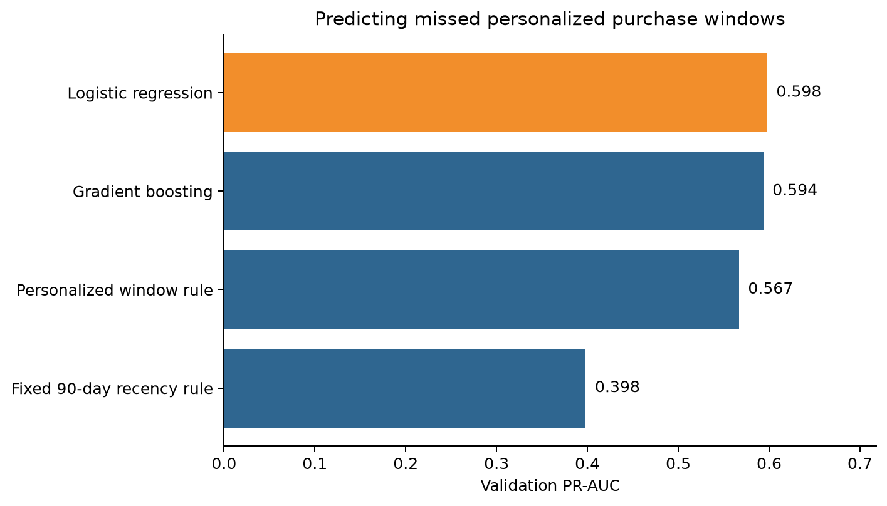
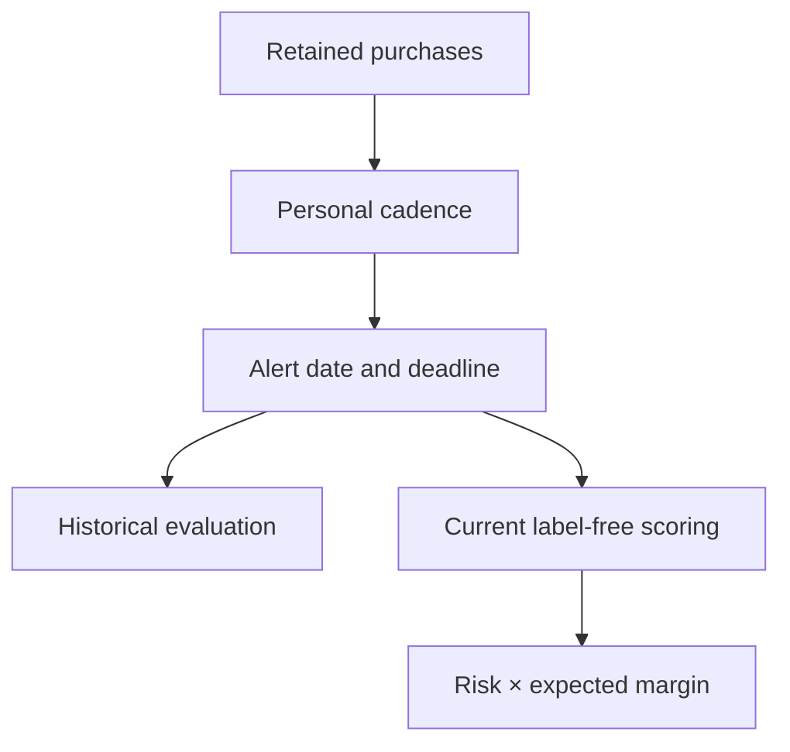
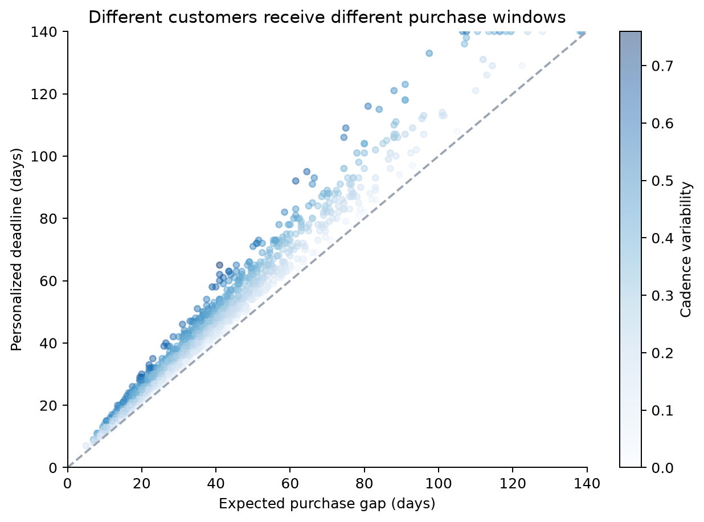
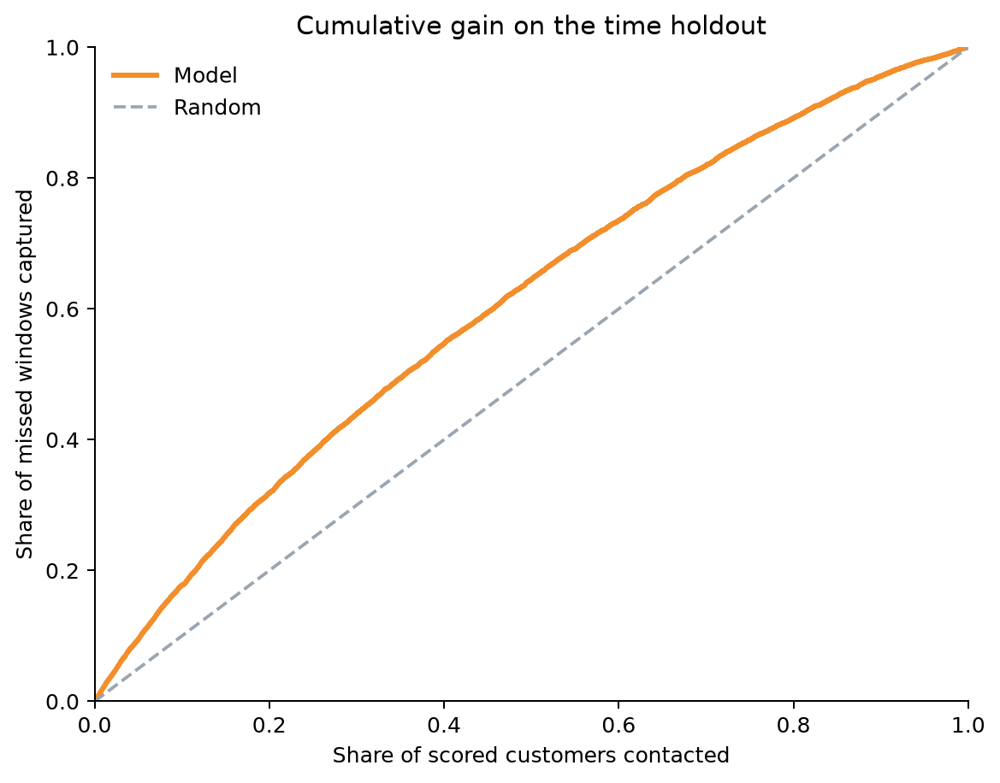
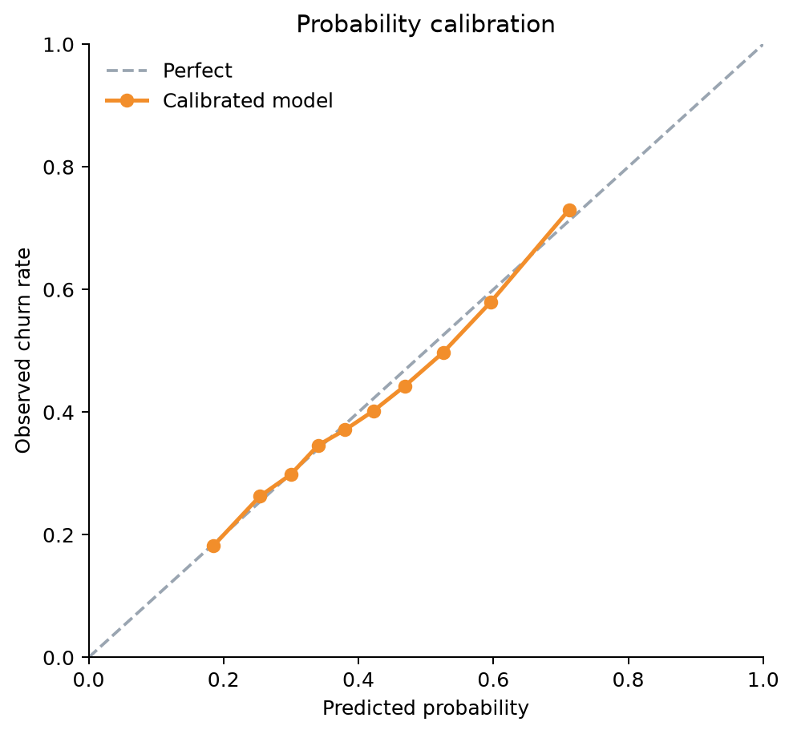
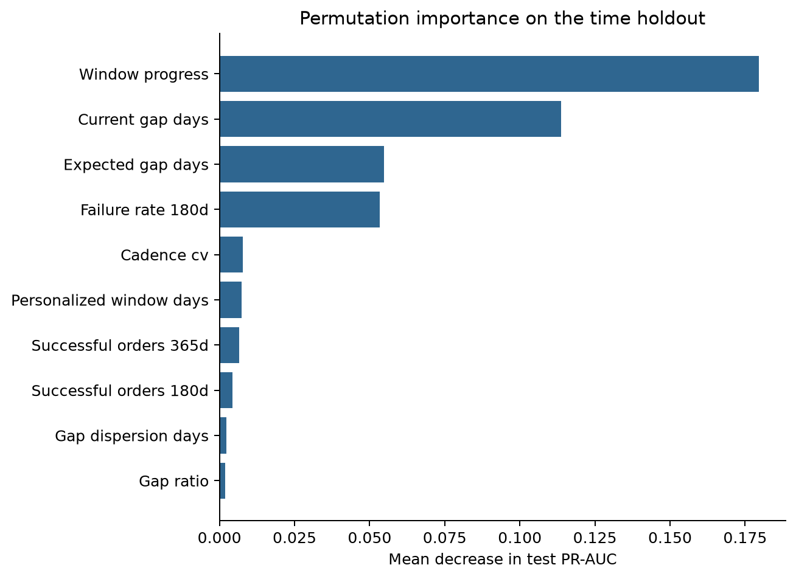
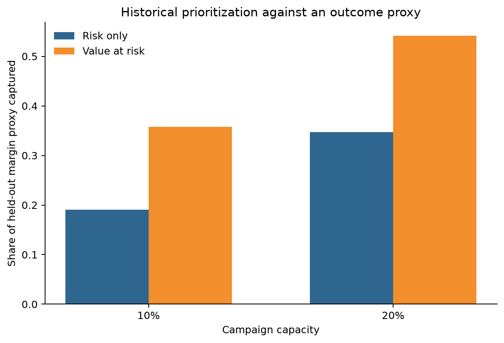

# Customer Churn in Personalized Purchase Windows

[](https://github.com/parisaMSTFV/customer-churn-personalized-window/actions/workflows/ci.yml)


Customer churn is not the same calendar interval for everyone. A customer who normally buys
every 40 days should not be evaluated with the same fixed 90-day rule as a weekly customer. This
project predicts whether each customer will miss the next deadline implied by their own retained
purchase cadence, then creates a separate label-free operational score.

| Checked-in synthetic test period | Result |
|---|---:|
| PR-AUC | 0.602 |
| Customer-cluster bootstrap 95% CI | 0.585–0.618 |
| ROC-AUC | 0.678 |
| Brier score | 0.218 |
| Recall at top 20% | 31.9% |
| Lift at top 20% | 1.59x |



## Two distinct workflows

Train and evaluate on a complete, explicitly bounded history:

```bash
export CHURN_ID_SALT="deployment-owned-secret-at-least-16-characters"
churn-pipeline run \
  --input-transactions path/to/transactions.csv.gz \
  --observation-end 2026-06-30 \
  --project-root artifacts/churn-run
```

Apply the fitted bundle to a current history without constructing a future label:

```bash
churn-pipeline score \
  --input-transactions path/to/current-transactions.csv.gz \
  --observation-end 2026-07-31 \
  --model-bundle artifacts/churn-run/models/personalized_churn_model.joblib \
  --output-root artifacts/churn-score
```

`operational_scores.csv` contains pseudonymous `customer_key` values, probabilities, and ranking
fields. It contains no raw customer ID and no churn truth. See the strict
[transaction contract](docs/INPUT_SCHEMA.md).

## Business question

Among customers approaching the end of their expected purchase cycle:

1. Who is likely to miss their personalized purchase window?
2. With limited retention capacity, should customers be ranked by risk alone or by
   probability-weighted expected margin?



A retained purchase is neither cancelled nor returned. Returned orders remain failure signals,
but cannot anchor cadence or close a purchase window. The observation boundary is supplied by the
caller; it is never inferred from the final row in a file.



## Leakage-resistant evaluation

Every historical row is a point-in-time snapshot. Features use only events visible at that date,
and deadlines extending past the observation cutoff are removed. Four chronological periods have
separate jobs:

| Period | Purpose |
|---|---|
| Train | Fit candidate models |
| Validation | Select the candidate by PR-AUC |
| Calibration | Fit probability calibration after refitting on train + validation |
| Test | Report final performance once |

Fixed 90-day and personalized-window rules are deployable candidates alongside logistic
regression and histogram gradient boosting. Reported metrics include PR-AUC, ROC-AUC, Brier score,
log loss, expected calibration error, calibration slope/intercept, and top-10%/top-20% ranking.
Uncertainty comes from 200 customer-cluster bootstrap replicates.





## Latest reproducible run

The committed benchmark uses 4,000 simulated customers, 68,781 transactions, and seed `42`.

| Measure | Result |
|---|---:|
| Historical modeling snapshots | 32,195 |
| Customers eligible for personal cadence | 89.75% |
| Missed-window rate | 41.74% |
| Current actionable customers | 1,079 |
| Selected candidate | Logistic regression |
| PR-AUC | 0.602 |
| Brier score | 0.218 |
| Expected calibration error | 0.014 |
| Feature-drift diagnostic | OK |

These numbers verify the workflow on synthetic data. They are not production-performance or
incremental-retention claims.



## Capacity-limited prioritization

```text
Risk-only score = P(miss personalized window)
Value-at-risk score = P(miss personalized window) × expected margin over 180 days
```

Historical comparison uses the held-out proxy `missed window × expected 180-day margin`. At 20%
capacity, risk-only ranking captures 34.7% of that proxy and 29.8% of missed windows; value-at-risk
captures 54.1% and 25.0%, respectively. The comparison therefore exposes the trade-off between
customer recall and value concentration. It is not an uplift or incremental-profit estimate.



## Bundle, drift, and privacy controls

- Bundle version `2.0` stores the model, calibrator, feature order, configuration, software
  versions, development reference, observation date, and input fingerprint.
- `feature_drift.csv` compares current medians and missing rates with the development reference;
  a two-robust-scale warning is diagnostic only.
- Contract `transaction-history-v2.0` preserves leading-zero IDs, rejects spreadsheet-formula
  prefixes, enforces exact columns and resource limits, and omits source filenames from provenance.
- Supplied data requires a deployment-owned `CHURN_ID_SALT`; public customer-level reports contain
  only stable 24-character HMAC keys.

## Stability check

Five 700-customer runs selected logistic regression five times. Across seeds `7`, `17`, `27`,
`37`, and `47`, PR-AUC ranged from 0.588 to 0.632, Brier score from 0.214 to 0.227, and expected
calibration error from 0.033 to 0.050. See [stability.csv](reports/stability.csv).

## Reproduce and verify

Python 3.11 or 3.12 and `uv` are required.

```bash
uv sync --frozen --all-extras
uv run churn-pipeline run --project-root . --customers 4000 --seed 42
uv run python scripts/run_stability.py
uv run ruff check .
uv run ruff format --check .
uv run pytest
uv run python scripts/check_sensitive.py
make wheel-smoke
```

CI uses `uv.lock`, pinned GitHub Action SHAs, a 90% branch-coverage gate, source and supplied-input
smokes, operational scoring, and installation of the built wheel in an isolated non-editable
environment.

## Repository structure

```text
.
├── src/customer_churn/     # simulation, cadence, features, models, scoring
├── tests/                  # 40 tests, including privacy and wheel-safe paths
├── scripts/                # stability benchmark and sensitive-content scan
├── reports/                # synthetic metrics, pseudonymous scores, tables, figures
├── docs/INPUT_SCHEMA.md    # strict supplied-data contract
├── docs/model_card.md      # intended use, evaluation, and limitations
└── .github/workflows/ci.yml
```

Generated transactions, fitted models, supplied inputs, and ad hoc output roots are ignored by
Git. See [the run summary](reports/run_summary.md), [full metrics](reports/metrics.json), and the
[model card](docs/model_card.md).
