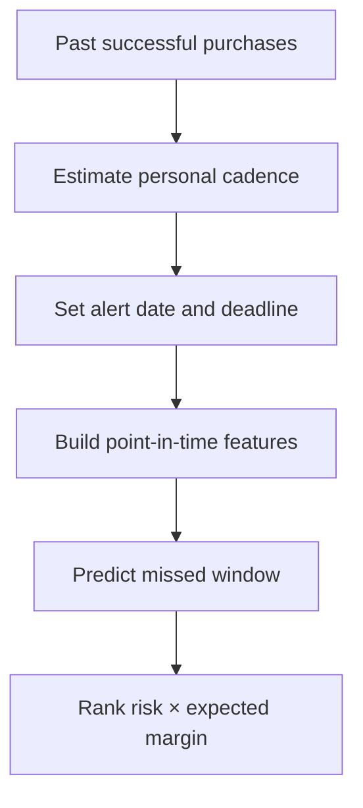

# Customer Churn in Personalized Purchase Windows

[](https://github.com/parisaMSTFV/customer-churn-personalized-window/actions/workflows/ci.yml)


Customer churn is not the same calendar interval for everyone. A customer who normally buys
every 40 days should not be evaluated with the same fixed 90-day rule as a weekly customer.
This project predicts whether each customer will miss the next purchase deadline implied by
their own historical cadence.

| Checked-in synthetic time holdout | Result |
|---|---:|
| PR-AUC | 0.602 |
| Brier score | 0.217 |
| Recall at top 20% | 32.0% |
| Lift at top 20% | 1.60x |


```bash
churn-pipeline run --input-transactions path/to/transactions.csv.gz --project-root artifacts/churn-run
```

The committed metrics come from synthetic transactions and verify the workflow only. Supplied histories receive their own time-holdout evaluation and checksum provenance; neither mode estimates incremental retention impact.

## Business question

Among customers approaching the end of their expected purchase cycle:

1. Who is likely to miss their personalized purchase window?
2. With limited retention capacity, should customers be ranked by churn risk alone or by
   probability-weighted value at risk?

## Decision flow



For a stable 40-day buyer, the expected gap and deadline are approximately 40 days. A more
irregular buyer receives an uncertainty buffer based on the median absolute deviation of recent
purchase gaps. Scoring happens before the deadline, so there is still time to act.


## Use your transaction history

The `transaction-history-v1.0` input path validates identifiers, dates, numeric values, business flags, category IDs, minimum history, and file integrity before any feature is built. The source filename, SHA-256, row/customer counts, and date range are written into `reports/metrics.json`.

```bash
python -m pip install -e ".[dev]"
churn-pipeline run \
  --input-transactions path/to/transactions.csv \
  --project-root artifacts/churn-run
```

The source file is not copied. Derived datasets and priority samples retain `customer_id`, so the output directory must be governed. See the complete [transaction contract](docs/INPUT_SCHEMA.md).

## What makes the target actionable

Each row is a historical scoring snapshot:

- Cadence uses only successful orders available up to the last purchase.
- A customer becomes eligible after reaching 55% of their expected gap.
- The first biweekly scoring run after that alert point creates one snapshot for the purchase spell.
- The target is one when the next successful purchase falls after the personalized deadline or
  does not occur.
- Deadlines beyond the observation period are excluded to prevent right-censoring errors.

This setup prevents future orders from entering model features and keeps train, calibration,
and test periods in chronological order.

## Modeling

The pipeline compares:

- a fixed 90-day recency rule;
- a rule based on progress through the personalized window;
- logistic regression;
- histogram gradient boosting.

The primary metric is PR-AUC. ROC-AUC, Brier score, calibration, lift, and recall at the top
10% and 20% are also reported.


### Latest reproducible run

The committed report was produced from 4,000 simulated customers and seed `42`.

| Time-holdout measure | Result |
|---|---:|
| Eligible snapshots | 33,486 |
| Customers with enough history | 90.6% |
| PR-AUC | 0.602 |
| ROC-AUC | 0.685 |
| Brier score | 0.217 |
| Recall in the top 20% | 32.0% |
| Lift in the top 20% | 1.60x |

These are synthetic-data results used to verify the pipeline, not expected production
performance.


## Retention prioritization

The project separates prediction from action. It compares:

```text
Risk-only score = P(miss personalized window)
Value-at-risk score = P(miss personalized window) × expected margin over 180 days
```


This is a prioritization heuristic, not an uplift estimate. A randomized experiment or uplift
model is required to claim that a campaign caused incremental retention.

## Repository structure

```text
.
├── src/customer_churn/     # simulation, cadence, features, models, evaluation
├── tests/                  # cadence, leakage, and prioritization tests
├── scripts/                # public-file sensitive-content scan
├── reports/                # reproducible metrics, tables, and figures
├── docs/INPUT_SCHEMA.md    # supplied transaction contract and claim boundary
├── docs/model_card.md      # intended use and limitations
└── .github/workflows/ci.yml
```

## Reproduce the project

Python 3.11 or later is required.

```bash
python -m venv .venv
source .venv/bin/activate
python -m pip install -e ".[dev]"
python -m customer_churn.cli run
python -m ruff check .
python -m ruff format --check .
python -m pytest
python scripts/check_sensitive.py
```

Generated transactions, feature tables, and fitted models are written to ignored directories. In supplied-input mode, the caller selects that output root. Only the compact synthetic benchmark reports are committed.

See [the latest run summary](reports/run_summary.md), [full metrics](reports/metrics.json), and
the [model card](docs/model_card.md).

## Limitations

- At least four successful purchases are required for an individual cadence. Newer customers
  need a cohort-level fallback and are reported outside model coverage.
- The synthetic generator simplifies seasonality, marketing contacts, availability, and
  customer life events.
- Historical value is not the same as incremental saveable value.
- Supplied-history metrics remain observational forecasting evidence; they do not establish campaign lift or transportability.
- Production use would require governed data, drift monitoring, fairness checks, contact
  constraints, and controlled experimentation.
